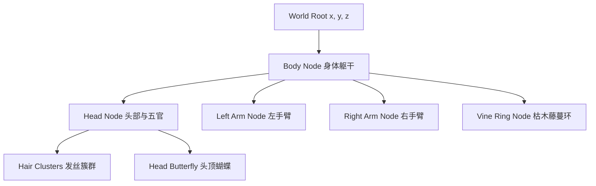

# Dimoo 层级假骨骼与动作特效设计规格书 (Dimoo Hierarchical Skeleton & Actions Design Spec)

本文档记录了为 Dimoo 3D 模型设计和实现层级变换（Hierarchical Transform）假骨骼、动作动画（行走、普攻、技能、大招）以及相关视觉特效与交互的详细方案。

---

## 1. 假骨骼层级变换设计 (Hierarchical Transform Structure)

将原有的扁平拼接渲染逻辑重构为树状嵌套结构，使得父节点的变换能自然传递给子节点：

### 关节相对坐标（Body 中心为 Y=0.45 相对基准点）
- **Body**: 绝对高度基准偏移 `Y=0.45`。应用全身漂浮 (`floatLift`)、移动倾斜 (`moveLean`)、呼吸缩放 (`bodyBreath`)。
- **Head**: 相对 Body 偏移 `(0.0, 0.0, 0.0)`。应用头部呼吸微动与受击错位偏移。
- **Left Arm**: 相对 Body 偏移 `(-0.36, -0.10, 0.07)`。
- **Right Arm**: 相对 Body 偏移 `(0.35, -0.11, 0.11)`。
- **Vine Ring**: 相对 Body 偏移 `(0.0, 0.01, 0.0)`。
- **Head Butterfly**: 相对 Head 偏移 `(0.17, 0.35, 0.23)`。

---

## 2. 过程化动作动画设计 (Procedural Animations)

所有的动画均通过 `DimooVisualState` 中的插值参数（`moveBlend`、`attackPulse`、`skillPulse` 以及新增的 `ultPulse`）配合全局时间 $t$ 驱动：

### 2.1 待机 (Idle)
- **参数**：`moveBlend = 0.0`, `attackPulse = 0.0`, `skillPulse = 0.0`, `ultPulse = 0.0`
- **动画表现**：
  - Body 漂浮：$Y_{\text{lift}} = \sin(t \times 2.2) \times 0.034$。
  - Body 呼吸：Scale 乘以 $(1.0 + \sin(t \times 2.0) \times 0.014)$。
  - 左右手臂：绕 Z 轴做 $\sin(t \times 2.8) \times 15^\circ$ 的微弱摆动，呈相反相位。
  - 藤蔓环：以极慢速度在 Y 轴自转 $t \times 10^\circ$。

### 2.2 行走 (Walk)
- **参数**：`moveBlend -> 1.0`
- **动画表现**：
  - 全身倾斜：在 Body 节点绕 Z 轴旋转 $moveLean = \sin(t \times 5.6) \times 4.0^\circ \times moveBlend$。
  - 头部抖动：在 Head 节点添加 $\Delta Y = 0.008 \times |\sin(t \times 5.6)| \times moveBlend$ 的颠簸。
  - 左右手臂：交替在 X 轴与 Z 轴做大范围的前后摆动，幅值达 $35^\circ$。
  - 藤蔓环：由于移动惯性，绕 Z 轴倾斜 $-drag \times 8^\circ$（其中 $drag = moveBlend \times 0.06$）。

### 2.3 普攻 — 梦蝶飞袭 (Attack)
- **参数**：`attackPulse` 由 $1.0 \to 0.0$（衰减率约为 1.9/秒）
- **动画表现**：
  - 挥手施法：右手臂绕 X 轴和 Z 轴向斜上方瞬间抬起（旋转约 $60^\circ \times attackPulse$），并在后摇时平滑落下。
  - 上身冲力：Body 绕 Z 轴或 Y 轴产生攻击方向的瞬时偏转。

### 2.4 技能 — 入梦 (Skill)
- **参数**：`skillPulse` 由 $1.2 \to 0.0$（衰减率约为 1.1/秒）
- **动画表现**：
  - 仪式抬手：双臂同时高举过头并微屈（绕 Z 轴旋转约 $45^\circ \times \text{clamp}(skillPulse, 0, 1)$）。
  - 身体升空：Body 节点额外增加 $\Delta Y = 0.05 \times \text{clamp}(skillPulse, 0, 1)$ 的高度。

### 2.5 大招 — 蝴蝶梦境 (Ultimate)
- **参数**：`ultPulse`（在 Game 类中新增，释放大招时设为 $1.5 \to 0.0$，衰减率 1.0/秒）
- **动画表现**：
  - 凌空舒展：Body 节点额外爬升 $\Delta Y = 0.23 \times \text{clamp}(ultPulse, 0, 1.2)$，且材质的 Diffuse/Ambient 属性融合珍珠白发光。
  - 拥抱世界：双臂向身体两侧完全张开（T-Pose 状，左臂顺时针旋转，右臂逆时针旋转）。
  - 藤蔓暴转：藤蔓环绕 Y 轴在原有缓慢自转的基础上，叠加 $ultPulse \times 720^\circ/\text{秒}$ 的高速旋转。

---

## 3. 特效与交互设计 (VFX & Interactions)

### 3.1 视觉特效 (VFX)
- **蝴蝶爆发系统**：
  - 普攻释放时，向朝向侧爆散 4 只蝴蝶粒子。
  - 技能释放时，以 Dimoo 为中心爆散 14 只带有淡蓝渐变绿尾焰的蝴蝶。
  - 大招释放时，爆散 40 只蝴蝶，扩散半径扩大 2.0 倍，粒子大小增加。
- **全屏梦境泛白**：
  - 当 `ultPulse > 0` 时，在 2D HUD 绘制层渲染一个半透明白色全屏遮罩，其 Alpha 值跟随 $\sin(ultPulse \times \pi / 1.5) \times 0.45$ 曲线，实现柔和的泛白爆开再淡出。
- **藤蔓流光线圈**：
  - 当 `skillPulse > 0.01` 时，使用 `GL_LINE_LOOP` 渲染多圈发光环，Alpha 随 `skillPulse` 的值而增强。

### 3.2 场景反馈 (Interactions)
- **纸盒盖大震荡**：大招命中或释放时，调用 `arena.triggerLidShake(45.0f)` 震飞/震荡斜靠的盲盒盖。
- **镜头多重抖动**：在 `Game::performDimooAttack` 中，普攻/技能/大招分别调用 `camera.applyShake(0.18f / 0.26f / 0.45f)`。
- **落地扬尘**：Dimoo 大招结束落回基准高度时，在其投影中心触发 `spawnDust` 生成一片上升散开的黄灰色纸屑烟尘。

---

## 4. 拟修改的文件 (Proposed File Changes)

- **[Common.hpp](file:///f:/Degree/Last%20Sem/TCG/Project/src/Common.hpp)**：
  - 在 `InputState` 和 `AnimState` 相关联的地方支持大招。
- **[DimooModel.h](file:///f:/Degree/Last%20Sem/TCG/Project/src/DimooModel.h)**：
  - 在 `DimooVisualState` 中增加 `ultPulse` 参数。
- **[DimooModel.cpp](file:///f:/Degree/Last%20Sem/TCG/Project/src/DimooModel.cpp)**：
  - 重构 `draw` 函数，建立 `glPushMatrix` / `glPopMatrix` 父子节点嵌套层级。
  - 重构 `drawMascotBody`，应用左右手臂的层级旋转与动作插值。
  - 重构 `drawVineRing`，支持大招的高速旋转。
- **[Game.h](file:///f:/Degree/Last%20Sem/TCG/Project/src/Game.h)**：
  - 增加 `dimooUltPulse` 计时参数。
- **[Game.cpp](file:///f:/Degree/Last%20Sem/TCG/Project/src/Game.cpp)**：
  - 在 `updateDimooVisuals` 中更新 `dimooUltPulse`。
  - 在 `buildDimooVisualState` 中填充 `ultPulse`。
  - 在 `performDimooAttack` 中，针对大招（`attackLevel == 3`）设置 `dimooUltPulse = 1.5f`。
  - 在 `Game::draw` 渲染层中，当 `dimooUltPulse > 0` 时绘制全屏半透明白色 Quad 实现全屏梦境泛白效果。

---

## 5. 验证方案 (Verification Plan)

1. **编译运行**：
   在 `Project` 目录下重新编译项目，启动 `FightingGame.exe` 验证战斗效果。
2. **动作连贯性测试**：
   - 操控 P2 (Dimoo) 进行左右移动，检查身体微倾、双臂交替摆动和藤蔓惯性拖拽。
   - 分别使用键盘 `U`, `O`, `P`（或手柄/传统按键）触发普攻、技能、大招。
   - 检查双手臂是否根据动作参数做顺滑摆动，受击时是否能够正常漂浮。
3. **特效与交互测试**：
   - 验证大招释放时，是否伴随屏幕泛白梦幻滤镜、藤蔓环的高速自转以及 40 只蝴蝶的集体爆发。
   - 检查大招释放瞬间，竞技场的纸盒盖（Arena Lid）是否开始剧烈震动。
