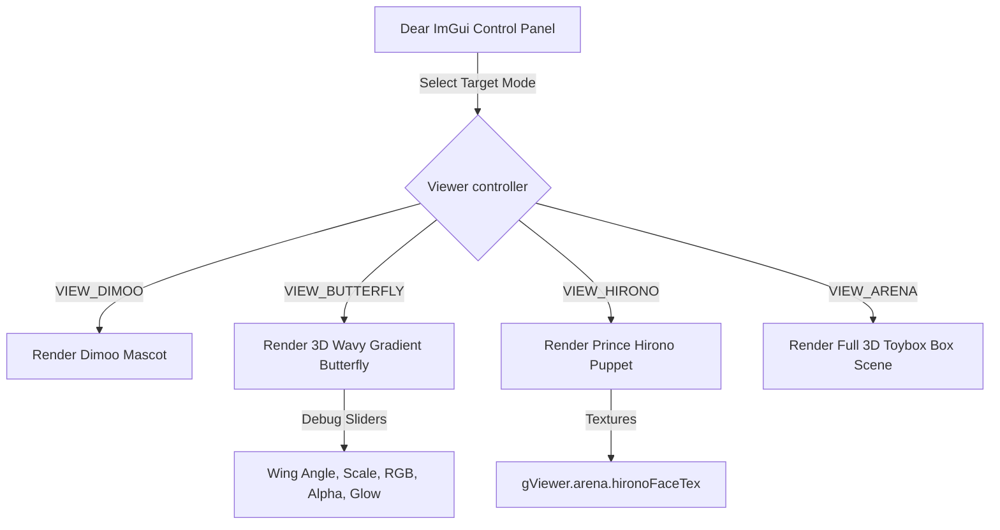

# Design Spec - Polar Parametric 3D Wavy Butterfly & Multi-Mode Viewer

This document details the design and math representation of the polar-coordinate wave gradient butterfly rendering model, and the architecture of the upgraded model viewer supporting Dimoo, Butterfly, Hirono, and Arena mode toggles.

## 1. Polar Parametric 3D Wing Contours

Rather than using primitive flat triangles, the new butterfly wing contour is generated procedurally in polar coordinates using a parametric wave equation $R(\theta)$ where the radius varies by angle $\theta \in [-\pi/2, \pi/2]$:

- **Front Wing Contour ($\theta > 0.0$)**:
  $$R_{front}(\theta) = 0.52 + 0.48\sin(\theta) + 0.35\cos(\theta)$$
- **Rear Wing Contour ($\theta \le 0.0$)**:
  $$R_{rear}(\theta) = 0.42 + 0.28\cos(\theta) - 0.15\sin(\theta)$$
- **Harmonic Waves (Wavy Edge)**:
  $$\text{wave}(\theta) = 0.045\sin(11\theta) + (\theta > 0.3 ? 0.03\sin(17\theta) : 0.0)$$
  $$R_{polar}(\theta) = R_{base}(\theta) + \text{wave}(\theta)$$

### Color & Spot Gradients
- **Horizontal Linear Gradient**: Interpolates wing vertex colors dynamically by mapping the polar range factor $F = (\theta + \pi/2)/\pi$.
- **Dark Spot Pattern**: Generates the custom dark-blue lower wing markings by multiplying local RGB channels when $\theta < -0.15$ and the vertex lies inside the radial spot circle:
  $$\text{dist\_to\_spot} = \sqrt{(\theta - (-0.55))^2 + (R_{polar} - 0.55)^2} < 0.18$$

## 2. Model Viewer Upgrade Architecture

`DimooViewer` compiles via `cbp.mak viewerdebug` with the compiled `Arena.o` successfully linked.

- **VIEW_DIMOO**: Mascot meshes draw with existing bone/hair tuners.
- **VIEW_BUTTERFLY**: Dynamic rendering of the standalone 3D polar wave butterfly, spinning slowly at `gViewer.visual.time * 26.0` degrees with dynamic inspector slider bounds.
- **VIEW_HIRONO**: Renders the 2D layered Prince Hirono puppet using transparent face textures extracted from the Arena instance.
- **VIEW_ARENA**: Updates physical box lid hinge physics and renders the full cardboard arena scene mesh.
